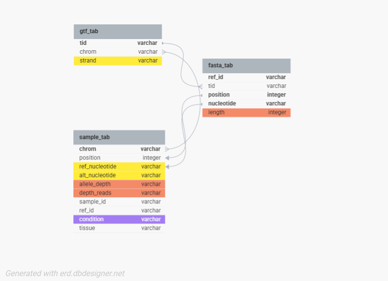
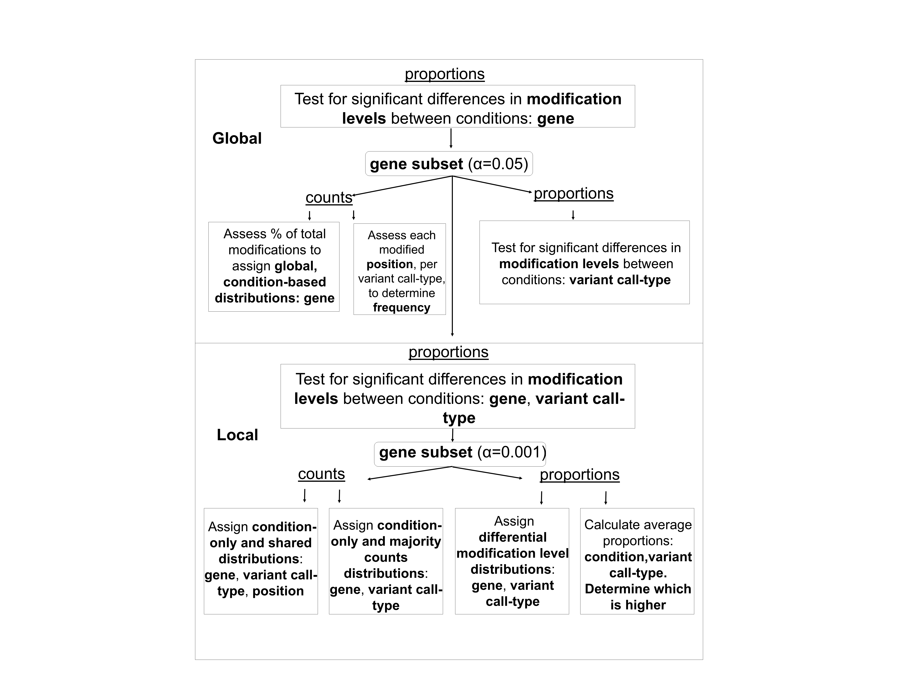

README
================
kat j
2025-04-27

- [**T**ranscript **A**nalysis of **R**NA **Va**riants
  (TARVa)](#transcript-analysis-of-rna-variants-tarva)
  - [Project Overview](#project-overview)
  - [Tools, Environments and
    Dependencies](#tools-environments-and-dependencies)
  - [Directory Structure](#directory-structure)
  - [Workflow Overview](#workflow-overview)
  - [Limitations and Considerations](#limitations-and-considerations)
  - [License](#license)

# **T**ranscript **A**nalysis of **R**NA **Va**riants (TARVa)

## Project Overview

[**TARVa**](#transcript-analysis-of-rna-variants-tarva) is a tool which
enables analysis of epitranscriptomic modifications from raw RNA
sequencing data, taking into consideration both depth of read and length
of transcript, and scans for all variant call-types in a strand-aware
fashion. Starting with a global overview, the pipeline moves through
non-hierarchical stratifications of the data, ending with local,
per-position comparisons across tissue types and conditions. The
workflow is set up for use with paired-sample raw RNAseq and whole
genome sequencing files (fastq) from more than one condition and/or
tissue, and covers three data preprocessing pipelines in addition to the
main TARVa analysis pipeline.

## Tools, Environments and Dependencies

Python 3 is a requirement for this workflow and custom conda
environments were created for each group of pipelines ([data
pre-processing](#data-pre-processing-pipelines), [TARVa
analysis](#tarva-analysis-pipelines)).

For [**data pre-processing
pipelines**](#data-pre-processing-pipes)
([Stringtie](StringtiePipe/), [GATK WGS](GatkWGSeqPipe/), [GATK
RNA](GatkRnaSeqPipe/)):  
- conda envs  
– *bio_qc* dependencies ([text](bio_qc_channels_dependencies.txt),
[yml](bio_qc.yml))

- R/4.3.3

- samtools/1.11

- gatk/4.2.0

- STAR

- Stringtie

- BWA

For the [**TARVa analysis
pipelines**](#tarva-analysis-pipes)
([DB Build](TARVaCreation/OriginalBuild/), [Analysis set
1](TARVaCreation/DownStreamDBCleanup/), [Analysis set
2](TARVaCreation/SecondSetBuild/)):  
- conda envs  
– *tarva* dependencies ([text](tarva_channels_dependencies.txt),
[yml](tarva.yml))

- python modules  
  – *sqlite3*  
  – *numpy*  
  – *scipy*  
  – *pandas*  
  – *statsmodels*  
  – *vcf*

## Directory Structure

<strong>📂 Project Directory Tree (click to expand)</strong>

<pre><code>.
├── GatkRnaSeqPipe
│   ├── README_gatkRNA.Rmd
│   ├── README_gatkRNA.md
│   ├── README_gatkRNA_files
│   │   └── figure-gfm
│   │       └── pressure-1.png
│   ├── STAR_array.slurm
│   ├── full_gatk.py
│   ├── full_gatk.slurm
│   ├── gatkPipe.py
│   ├── match_monocytes.py
│   ├── runqc.py
│   ├── star.py
│   └── star_run.py
├── GatkWGSeqPipe
│   ├── README_gatkWGS.Rmd
│   ├── README_gatkWGS.md
│   ├── README_gatkWGS_files
│   │   └── figure-gfm
│   │       └── pressure-1.png
│   ├── Step1_alignment.slurm
│   ├── Step2_mergeBams.slurm
│   ├── Step3_5_sortUnalnBams.slurm
│   ├── Step3_mkUnalnBam.slurm
│   ├── Step4_MergeBamAlns.py
│   ├── Step4_MergeBamAlns.slurm
│   ├── Step5_MD_SS.py
│   ├── Step5_MarkDuplicates_SortSam.slurm
│   ├── Step6.py
│   ├── Step6_BaseRecal_ApplyBQSR.slurm
│   ├── Step7.py
│   ├── Step7_CreatePons.py
│   ├── Step7_DBImport.py
│   ├── Step7_Mutect2_PON.slurm
│   ├── Step7_SelectVars.py
│   ├── Step8_ApplyPonsToAD.py
│   ├── Step8_Mutect2_AD.slurm
│   ├── Step9_GetPileupSummaries.slurm
│   ├── Step9_GetPileupSummaries_AD.py
│   └── Step9_GetPileupSummaries_Control.py
├── LICENSE
├── README.Rmd
├── README.md
├── StringtiePipe
│   ├── DGE_Pipe1_RunStar.slurm
│   ├── DGE_Pipe2_Round2.py
│   ├── DGE_Pipe2_StringRound1.slurm
│   ├── DGE_Pipe2_StringRound2.slurm
│   ├── DGE_Pipe2_StringRound3.slurm
│   ├── DGE_Pipe3_MakeBallgownFiles.py
│   ├── README_Stringtie.Rmd
│   ├── README_Stringtie.md
│   └── README_Stringtie_files
│       └── figure-gfm
│           └── pressure-1.png
├── TARVa
│   └── LICENSE
├── TARVaCreation
│   ├── DownStreamDBCleanup
│   │   ├── AnET.slurm
│   │   ├── README_set1_downstream.Rmd
│   │   ├── README_set1_downstream.md
│   │   ├── adjust_lists.py
│   │   ├── anet.py
│   │   ├── parse_vep.py
│   │   ├── sep_call_type.py
│   │   └── type_by_gene.py
│   ├── OriginalBuild
│   │   ├── BuildTarvaDBs.py
│   │   ├── README_OriginalBuild.Rmd
│   │   ├── README_OriginalBuild.md
│   │   ├── README_OriginalBuild_files
│   │   │   └── figure-gfm
│   │   │       └── pressure-1.png
│   │   ├── analyze_lens.py
│   │   ├── build.slurm
│   │   ├── checkRNA_againstWGS.py
│   │   ├── each_gene.py
│   │   ├── make_sample_tabs.py
│   │   ├── proc_pos.py
│   │   └── raw_counts.py
│   └── SecondSetBuild
│       ├── Build_SecondSet.py
│       ├── README_secondset_build.Rmd
│       ├── README_secondset_build.md
│       ├── Rel_Abu.slurm
│       ├── build2.slurm
│       ├── fpkm_within_condition_analysis.py
│       ├── get_second_set_counts.py
│       ├── make_secondset_tabs.py
│       ├── read_mstrg_tab.py
│       └── tpm_analysis.py
├── bio_qc.yml
├── bio_qc_channels_dependencies.txt
├── structure.txt
├── tarva.yml
└── tarva_channels_dependencies.txt
&#10;17 directories, 81 files
</code></pre>

## Workflow Overview

To implement the full TARVa workflow, the following [**data
pre-processing
pipelines**](#data-pre-processing-pipelines)
are run in the following order:  
1. [Stringtie pipeline](StringtiePipe/)
([README](StringtiePipe/README_Stringtie.md))  
Stringtie receives STAR RNA sequencing alignment bam files as input and
creates transcript expression level files (.ctab) and a gtf file
containing nucleotide positions, transcript features, etc. of each
transcript identified in the dataset.

2.  [GATK WGS](GatkWGSeqPipe/)
    ([README](GatkWGSeqPipe/README_gatkWGS.md))  
    A GATK pipeline for small somatic variant-finding in WGS sequencing
    data is implemented to provide the TARVa tool with a baseline set of
    somatic genomic variants (vcf as output) for each sample. WGS data
    only for samples which also have RNAseq data available is used in
    this step.

3.  [GATK RNA](GatkRnaSeqPipe/)
    ([README](GatkRnaSeqPipe/README_gatkRNA.md))  
    For samples with WGS data that has been processed in the previous
    step, RNAseq sequencing data is run through a GATK pipeline for
    small variant finding in RNAseq (vcf as output).

Output from the data pre-processing phase of the workflow can then be
used as input for the [**TARVa analysis
pipelines**](#tarva-analysis-pipelines),
which can be executed in the following order:

1.  [DB Build](TARVaCreation/OriginalBuild/)
    ([README](TARVaCreation/OriginalBuild/README_OriginalBuild.md))  
    RNA variants are first parsed to filter out any genomic variants,
    then a database is built and populated from several data sources to
    store detailed information about RNA-specific modifications in the
    dataset. [**Figure 1**](#figure) shows the entity relationship
    diagram for the TARVa database.  
      
    **Figure 1.** *ERD of TARVa database structure*. **gtf_tab**
    contains information from the merged Stringtie GTF, **fasta_tab**
    contains values per nucleotide position in the reference fasta file,
    and **sample_tab** contains values from individual VCF files for all
    conditions and tissues. Yellow highlights: The reference nucleotide,
    alternate nucleotide, and strand information were used to determine
    variant call-type; Orange highlights: allele_depth, depth_reads, and
    length retrieved to calculate the proportion of reads modified for
    each instance of a variant call.

After the database is built and populated, analyses from the global
level overview down to per-base resolution are carried out. [**Figure
2**](#fig) shows the levels of analyses.

**Figure 2.** *Global and local level analyses*. At the global level,
analyses were started with calculated proportions of modified
transcripts and conducted across all genes in which the proportion of
modified transcripts were significantly different (P value \<0.05)
between different conditions or tissues, independent of variant types.
Modified gene transcripts were assessed for significant differences in
counts and proportions of each variant call-type at the global gene
level. Local-level analyses were conducted, starting first with analysis
of proportions of modified transcripts at the gene, variant-type, and
position levels for genes in which the difference in proportion of
modified transcripts between conditions or tissues were highly
significant (P value 0\<0.001).

2.  [Analysis set 1](TARVaCreation/DownStreamDBCleanup/)
    ([README](TARVaCreation/DownStreamDBCleanup/README_set1_downstream.md))  
    Analyses of first set of data, consisting of one tissue type, two
    different conditions.

3.  [Analysis set 2](TARVaCreation/SecondSetBuild/)
    ([README](TARVaCreation/SecondSetBuild/README_secondset_build.md))  
    Analyses of second set of data, consisting of a third condition for
    the tissue type assessed in the previous step and the three same
    conditions for a different tissue.

## Limitations and Considerations

- This tool was created for and tested on datasets from the [__Religious Orders Study/Memory and Aging Project (ROSMAP)__](https://dss.niagads.org/cohorts/religious-orders-study-memory-and-aging-project-rosmap/). While the code works for the ROSMAP dataset in computing environments comparable to the testing environment,  it is not yet generalizable to other datasets or computing environments. Analysis Set 2 was added on later in the project but could be integrated with Analysis set 1 so that all conditions and tissues can be assessed simultaneously.                                                             

- Current goals for development include the following:  
  – fix code and database redundancies  
  – replace absolute paths with relative paths  
  – generalizability of condition, tissue, and related variables for
  applicability to different datasets

## [License](LICENSE)
